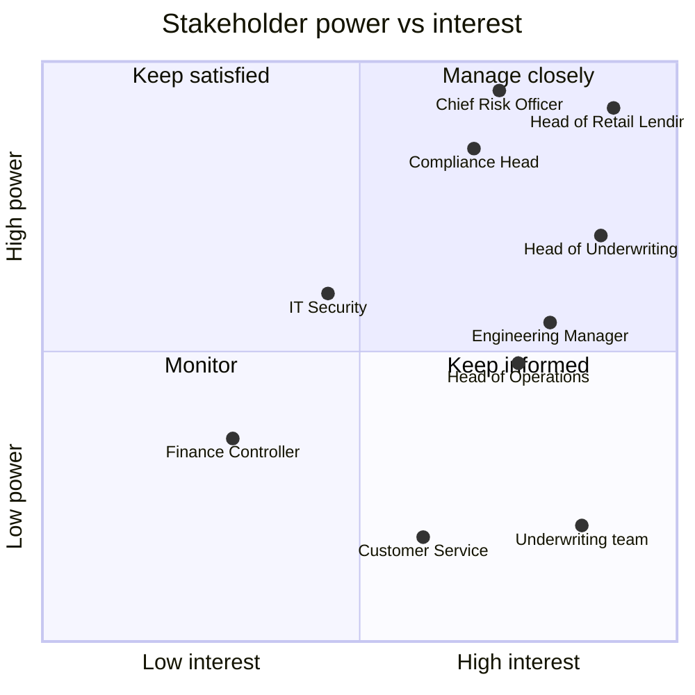

# Stakeholder Analysis and RACI

**Project:** Digital Personal Loan Origination (Project ORIGIN)
**Organisation:** Mid-size Indian NBFC, personal loans ₹50,000 – ₹10,00,000
**Document owner:** Business Analyst
**Version:** 1.2 · **Status:** Baselined

---

## 1. Stakeholder register

| ID | Stakeholder | Role | Interest | Influence | Engagement strategy |
|---|---|---|---|---|---|
| SH-01 | Head of Retail Lending | Sponsor | Owns the P&L target this project serves | **High** | Weekly 30-min steering; decisions escalated here |
| SH-02 | Chief Risk Officer | Approver | Credit policy must not loosen | **High** | Sign-off gate on all decisioning rules; no rule ships without CRO approval |
| SH-03 | Head of Credit Underwriting | Approver / SME | Underwriter workload and case quality | High | Workshop series for rule elicitation; owns referral band definition |
| SH-04 | Compliance & Regulatory Head | Approver | RBI Digital Lending Guidelines adherence | **High** | Review gate on KYC, consent and disclosure requirements |
| SH-05 | Head of Operations | Affected | Team restructuring as manual steps disappear | Medium | Fortnightly; needs early warning on headcount impact |
| SH-06 | Underwriting team (12 FTE) | End user | Day-to-day tooling | Low | Represented via SH-03; 3 members in UAT |
| SH-07 | Customer Service (18 FTE) | End user | Handles status queries | Low | Consulted on status-visibility requirements (BR-06) |
| SH-08 | Engineering Manager | Delivery | Feasibility, estimates, sequencing | Medium | Daily standup; joint refinement sessions |
| SH-09 | IT Security | Approver | Data protection, DPDP Act obligations | Medium | Review gate on NFR-06 through NFR-09 |
| SH-10 | Finance Controller | Consulted | Disbursal reconciliation | Low | Informed; consulted on FR-030 to FR-032 |
| SH-11 | Loan applicants | End user (external) | Speed, clarity, minimum effort | — | Not directly consultable; represented by call-centre complaint data and drop-off analytics |
| SH-12 | Account Aggregator provider | External vendor | Integration contract | Low | Managed via SH-08; SLA dependency (see DEP-02) |

### Power / interest positioning

**The non-obvious read:** the Chief Risk Officer sits in *keep satisfied* — very high power, more
moderate day-to-day interest. That combination is the main delivery risk on this project. A CRO
who is not engaged early does not block quietly; they block at sign-off, after the rules are
built. Hence the decision to gate every decisioning rule on CRO approval **before** development
rather than at UAT.

---

## 2. Elicitation plan

Technique chosen per stakeholder, because the technique should follow the constraint, not habit.

| Stakeholder | Technique | Why this one |
|---|---|---|
| SH-03 Underwriting Head | **Facilitated workshop + decision-table walkthrough** | Credit rules are conditional and interdependent. Interviews produce rules in isolation and miss the interactions; a decision table forces every combination to be resolved. |
| SH-02 CRO | **Document analysis then targeted interview** | Existing credit policy is already written. Reading it first means the interview spends its time on the *gaps* rather than re-hearing the policy. |
| SH-06 Underwriters | **Job shadowing (3 × half day)** | What people say they do and what they actually do diverge most in high-volume repetitive work. Shadowing found the offline Excel step (see AS-IS, step 6) that nobody mentioned in interview. |
| SH-04 Compliance | **Regulatory requirement mapping** | Requirements derive from published RBI guidelines, not from opinion. The task is mapping obligations to features, not eliciting preferences. |
| SH-07 Customer Service | **Call-log analysis (3 months, 4,180 calls)** | Their perception of "the most common query" was branch-visit questions; the logs showed 41% were application-status queries. Data beat recollection. |
| SH-11 Applicants | **Funnel analytics + complaint text analysis** | Not directly reachable. Behavioural data is the only honest proxy. |
| SH-08 Engineering | **Joint story refinement** | Feasibility is discovered by building the estimate together, not by handing over a spec. |

**Elicitation finding worth flagging:** shadowing contradicted interviews. Underwriters described
a 4-step assessment; observation showed 7, including two undocumented workarounds. Both
workarounds are in the AS-IS map and both are eliminated in TO-BE.

---

## 3. RACI

**R** Responsible (does the work) · **A** Accountable (single owner, signs off) · **C** Consulted
· **I** Informed

| Activity | BA | Sponsor | CRO | U/W Head | Compliance | Eng Mgr | Security | Ops |
|---|---|---|---|---|---|---|---|---|
| Business case and scope | R | **A** | C | C | C | I | I | C |
| Stakeholder analysis | **A/R** | I | I | C | I | I | I | C |
| AS-IS process mapping | **A/R** | I | I | C | I | I | I | C |
| TO-BE process design | R | C | C | **A** | C | C | I | C |
| Functional requirements | **A/R** | I | C | C | C | C | I | C |
| Credit decisioning rules | R | I | **A** | C | C | I | I | I |
| Non-functional requirements | R | I | I | I | C | **A** | C | I |
| Data model and dictionary | R | I | I | C | I | **A** | C | I |
| Regulatory compliance sign-off | C | I | C | I | **A** | I | C | I |
| Security and privacy sign-off | C | I | I | I | C | C | **A** | I |
| Story acceptance criteria | **A/R** | I | I | C | I | C | I | I |
| Sprint prioritisation | R | **A** | C | C | C | C | I | C |
| UAT plan and cases | **A/R** | I | I | C | C | C | I | C |
| UAT execution | C | I | I | R | R | C | I | **A** |
| Change request impact assessment | **A/R** | C | C | C | C | C | I | C |
| Go-live decision | C | **A** | C | C | C | C | C | C |

**Two deliberate choices in this matrix:**

- **Exactly one A per row.** Two accountable parties means nobody is accountable — the most
  common RACI error. Where ownership genuinely straddles two roles (TO-BE design), the A sits
  with the process owner and the BA takes R.
- **Credit decisioning rules are A = CRO, not A = BA.** The BA elicits, documents and validates
  the rules; the BA does not own credit risk appetite. Getting this backwards is how a BA ends up
  personally defending a lending policy in an audit.

---

## 4. Assumptions, dependencies, constraints, risks (RAID)

### Assumptions

| ID | Assumption | If false |
|---|---|---|
| ASM-01 | Aadhaar-based e-KYC remains permissible for this product class | KYC reverts to video-KYC; adds ~6 min to journey, TAT target at risk |
| ASM-02 | ≥70% of target applicants are salaried with bank statements accessible via Account Aggregator | Auto-decisioning coverage (BR-04) falls; more manual referrals |
| ASM-03 | Credit bureau API availability ≥99.5% | Eligibility decisions queue; NFR-02 breached |
| ASM-04 | No change to existing credit policy thresholds during delivery | Rules rework; est. 1 sprint per material change |

### Dependencies

| ID | Dependency | Owner | Needed by | Risk if late |
|---|---|---|---|---|
| DEP-01 | Credit bureau API contract renewal | Procurement | Sprint 1 start | Blocks FR-017; entire decisioning module stalls |
| DEP-02 | Account Aggregator integration certification | SH-12 vendor | Sprint 2 start | Fall back to manual statement upload; BR-03 target missed |
| DEP-03 | e-Sign / e-NACH provider onboarding | Legal + Procurement | Sprint 3 start | Disbursal remains manual; TAT target missed |
| DEP-04 | Production infrastructure sizing sign-off | IT Infrastructure | Sprint 2 end | NFR load targets cannot be verified before go-live |
| **DEP-05** | LMS enforces penalty-free exit within the cooling-off window, using the expiry supplied by FR-046 | LMS product owner, via SH-08 | **Pilot gate** | **Regulatory breach of BR-05.** ORIGIN discloses the right (FR-045); only the LMS can honour it. ⚠️ **Open — written confirmation requested, not received** |

**DEP-05 was added after baselining by CR-003 and is the only dependency that can fail *after* UAT
passes.** DEP-01 to DEP-04 all block delivery — if they slip, something visibly does not work. DEP-05
is different: every ORIGIN requirement can pass acceptance testing and the loan can still produce a
compliance finding, because the obligation is executed in a system outside this scope. That is why it
is a **go/no-go condition at the pilot gate** rather than a risk with a mitigation, and why the
recommendation is to hold go-live if it is unconfirmed. See
[11-change-request.md](11-change-request.md) CR-003.

### Constraints

| ID | Constraint | Type |
|---|---|---|
| CON-01 | Must integrate with existing core Loan Management System; no replacement in scope | Technical |
| CON-02 | Delivery window is 3 sprints (6 weeks) to hit the festive lending season | Schedule |
| CON-03 | No increase in underwriting headcount | Resource |
| CON-04 | All customer data must remain within India | Regulatory |

### Risks

| ID | Risk | P | I | Score | Mitigation | Owner |
|---|---|---|---|---|---|---|
| RSK-01 | CRO rejects the auto-approve band late in delivery | Med | **High** | 6 | Rules gated on CRO approval before development starts, not at UAT | BA |
| RSK-02 | Account Aggregator adoption lower than assumed, reducing auto-decision rate | High | Med | 6 | Manual statement upload retained as a fallback path (FR-015) | SH-03 |
| RSK-03 | Underwriter resistance — tool perceived as deskilling | Med | Med | 4 | 3 underwriters embedded in UAT; referral band framed as "cases needing judgement" | SH-05 |
| RSK-04 | Bureau API latency pushes NFR-02 breach | Med | Med | 4 | Cache bureau pull for 72h; async retry with applicant notification | SH-08 |
| RSK-05 | Scope creep from adjacent products (two-wheeler, gold loan) | High | Med | 6 | Explicit out-of-scope list in BRD §4; CR process for any addition | BA |

RSK-05 materialised during delivery. The impact assessment is documented in
[11-change-request.md](11-change-request.md).
