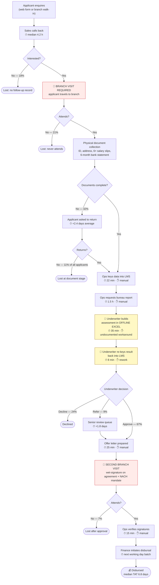
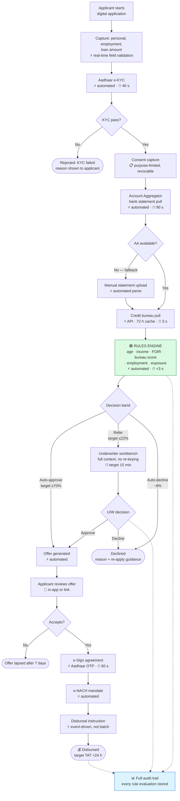

# Process Models: AS-IS, Gap Analysis, TO-BE

**Project ORIGIN** · Version 1.3 · Baselined

Every pain point below is quantified. An unquantified pain point cannot be prioritised against
anything else, and it cannot be shown to have been fixed.

---

## 1. AS-IS process

Measured over 3 months: 4,612 applications, 1,893 disbursals (**41.0% completion**), median TAT
**6.8 days**.

### Quantified pain points

| ID | Pain point | Measured impact | Root cause |
|---|---|---|---|
| **P-01** | Two mandatory branch visits | **28% cumulative loss** (21% at visit 1, 7% at visit 2) | Wet-signature requirement; no digital KYC |
| **P-02** | Incomplete documents on first attempt | 32% incomplete → 11% permanent loss, +2.4 days | No upfront validation; applicant guesses what is needed |
| **P-03** | Offline Excel assessment | 35 min/case, no audit trail, version drift between underwriters | LMS has no decisioning engine |
| **P-04** | Result re-keyed into LMS | 8 min/case pure rework; transcription errors | Excel step is not integrated |
| **P-05** | Manual bureau pull | 1.5 h latency per case | No API integration |
| **P-06** | Manual data entry from paper | 22 min/case | Paper-first capture |
| **P-07** | No status visibility | **41% of 4,180 support calls** are "where is my application?" | No applicant-facing status |
| **P-08** | Senior review queue | +1.8 days on 9% of cases | No documented referral criteria; escalation by instinct |
| **P-09** | Next-day disbursal batch | +up to 24 h | Batch process, not event-driven |

**Total manual handling: 1 h 45 min per application.** At 1,537 applications/month that is
**2,690 hours/month**, or approximately **16 FTE** of pure processing.

### The finding that came from shadowing, not interviews

Steps **P-03** and **P-04** — the offline Excel assessment and the re-keying — were described by
nobody in interview. Underwriters characterised their work as a 4-step assessment inside the LMS.
Shadowing revealed 7 steps, two of them undocumented workarounds built because the LMS cannot hold
an assessment.

This matters beyond the 43 minutes. **The Excel step means no audit trail exists for 100% of
credit decisions**, which is a regulatory exposure nobody had raised. It became BR-08.

---

## 2. Gap analysis

| Pain | Current state | Target state | Gap type | Addressed by |
|---|---|---|---|---|
| P-01 | Wet signature at branch | Aadhaar e-KYC + e-Sign + e-NACH | **Capability** | FR-007→FR-012, FR-026→FR-029 |
| P-02 | Post-hoc document check | Real-time validation at capture | Process + capability | FR-004, FR-005 |
| P-03 | Offline Excel | Rules engine inside the platform | **Capability** | FR-017→FR-024 |
| P-04 | Manual re-key | Single system of record | Process | FR-023, FR-042 |
| P-05 | Manual bureau request | API integration with 72 h cache | Capability | FR-017, FR-018 |
| P-06 | Paper → keyboard | Digital-first capture | Process | FR-001→FR-003 |
| P-07 | No visibility | Applicant status portal + notifications | Capability | FR-038→FR-041 |
| P-08 | Undocumented escalation | Explicit referral band in policy | **Policy** | BRULE-06, FR-022 |
| P-09 | Next-day batch | Event-driven disbursal instruction | Capability | FR-030→FR-032 |

**Note P-08 is a policy gap, not a technology gap.** No amount of software fixes an escalation
rule that has never been written down. This is the requirement most likely to be misclassified as
a development task, and doing so would have shipped a referral queue with no criteria for entering
it.

---

## 3. TO-BE process

### What changed, and what deliberately did not

| Removed | Retained | Why retained |
|---|---|---|
| Both branch visits | Underwriter referral path | Judgement cases genuinely exist; automating everything would either loosen credit policy or reject good applicants |
| Offline Excel assessment | Manual statement upload | Account Aggregator adoption is an assumption (ASM-02), so a fallback prevents a single dependency from breaking BR-03 |
| Manual re-keying | 7-day offer validity | Existing commercial policy; not a process defect |
| Paper document collection | Human decline review on request | Regulatory fairness; automated decline must be contestable |

**The Account Aggregator fallback is the most important design decision here.** ASM-02 assumes
≥70% AA coverage. If that assumption fails and there is no fallback, applications simply stop.
Retaining manual upload costs one extra requirement (FR-015) and removes a single point of failure
on an external dependency the project does not control.

---

## 4. Expected impact

| Metric | AS-IS (measured) | TO-BE (target) | Basis |
|---|---|---|---|
| Median TAT | 6.8 days | **< 24 h** | Sum of TO-BE step times + offer decision window |
| Application completion | 41.0% | **> 62%** | Removes P-01 (28%) and most of P-02; assumes 60% of that loss is recovered |
| Document-stage drop-off | 32% incomplete | **< 12%** | Real-time validation removes the "guess what is needed" failure |
| Auto-decisioned share | 0% | **≥ 70%** (backtested 73.4%) | Applying BRULE-01→08 retrospectively to 3 months of historical applications |
| Manual handling per application | 1 h 45 min | **< 20 min** | Only referred cases (26.6%) require human touch |
| Underwriter time per referred case | 35 min + 8 min rework | **< 15 min** | Context pre-assembled; no re-keying |
| Status-related support calls | 41% of volume | **< 15%** | Self-service status + proactive notifications |
| Decisions with audit trail | 0% | **100%** | Every rule evaluation persisted |

**The ≥70% auto-decision target is not aspirational.** It was validated by applying the drafted
decision tables to 4,612 historical applications: **73.4%** would have fallen in the auto-approve
or auto-decline bands, with an approval-rate variance of −1.2pp against actual underwriter
outcomes. That backtest is what made the target defensible to the CRO, and it is why the rules
were drafted before the target was committed rather than after.

> **The 73.4% figure is post-CR-002.** The first draft of BRULE-04 backtested at **78.1%**. The CRO
> narrowed one cell of the FOIR matrix during review, which cost 4.7pp of coverage and left only
> 3.4pp of headroom above the 70% target — the reason FR-044 (daily band distribution) was promoted
> from Should to Must. See [11-change-request.md](11-change-request.md) CR-002.
