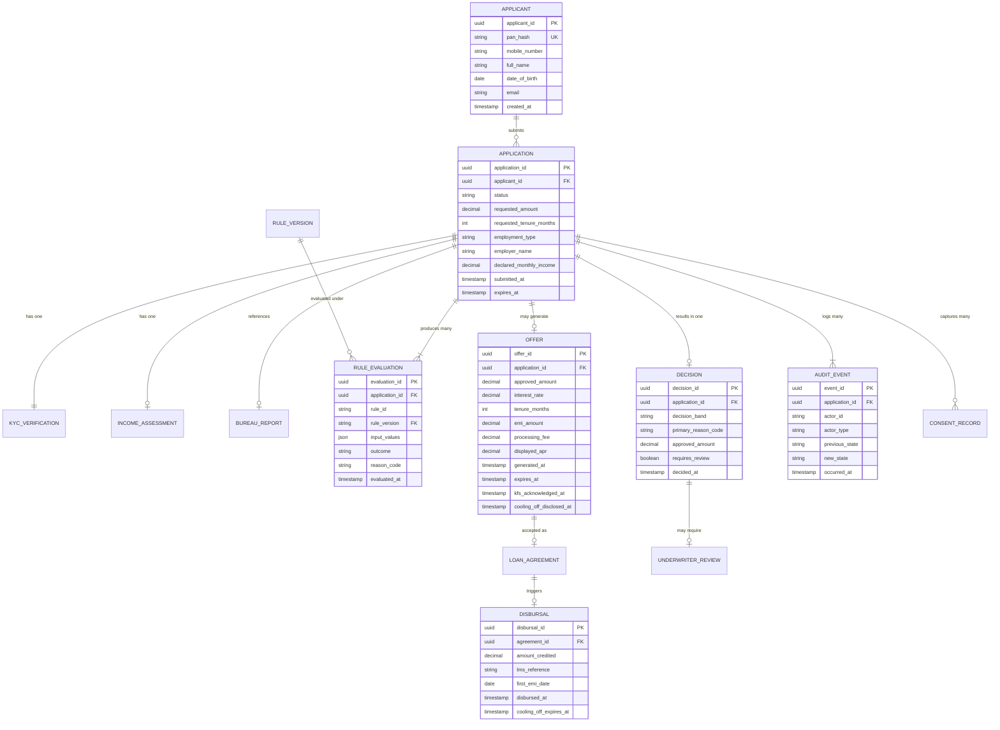
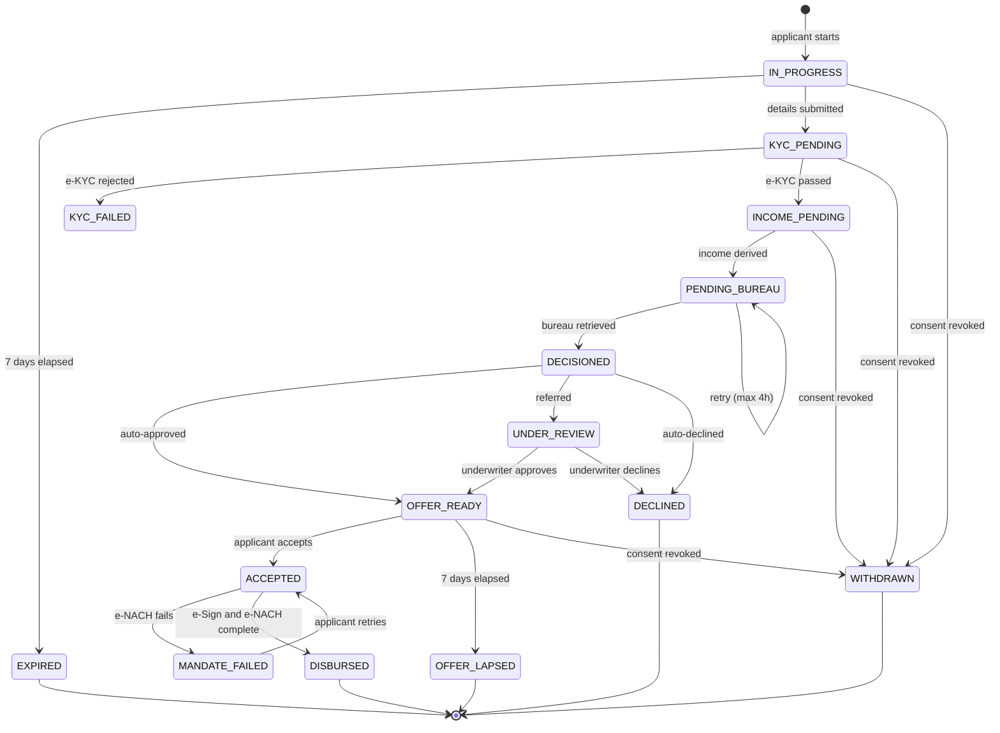

# Data Model and Data Dictionary

**Project ORIGIN** · Version 1.2 · Baselined
**Approver:** SH-08 Engineering Manager · **Reviewed by:** SH-09 IT Security

---

## 1. Entity relationship diagram

## 2. The four modelling decisions that matter

### 2.1 `RULE_EVALUATION` is a separate entity, one row per rule per application

The obvious design stores the final decision on `APPLICATION` and nothing else. That satisfies the
happy path and fails **BR-08** completely.

An auditor does not ask "what was the decision?" — they ask "why?". Answering requires the inputs
used, every rule evaluated, and the outcome of each. With 8 rules and ~1,540 applications a month
this is roughly 12,300 rows a month, which is trivial storage in exchange for the entire audit
capability.

It also captures the **precedence trail**: FRD §4.2 requires all rules to be evaluated even after a
decline, so the record shows that BRULE-03 said `REFER` and BRULE-05 said `AUTO_DECLINE`, and that
decline correctly won.

### 2.2 `rule_version` is a foreign key, not a string copied at write time

`RULE_VERSION` is its own entity holding the actual thresholds in force for each version.

**Why this is not over-engineering:** CR-002 changed BRULE-04 from v1.1 to v1.2 mid-project. An
application decided under v1.1 must reconstruct against v1.1. If only the version *label* were
stored, reconstruction would show "evaluated under v1.1" without being able to state what v1.1
actually required — which is not evidence. This is the requirement in US-16's second scenario.

### 2.3 PAN is stored as a hash, not as plaintext

`pan_hash` is the unique key on `APPLICANT`. The full PAN is needed for the bureau call but is not
retained afterwards.

This satisfies NFR-13 and NFR-18 while still allowing duplicate-application detection (US-01's last
scenario), because a deterministic hash of the same PAN yields the same key. Full Aadhaar is never
stored in any form (NFR-14).

---

### 2.4 The cooling-off deadline is a timestamp on `DISBURSAL`, not an application state

*Added by CR-003.*

FR-045 discloses the applicant's right to exit the loan within 3 days of disbursal; FR-046 computes
the deadline and hands it to the LMS. The obvious modelling instinct is to add a `COOLING_OFF` state
to the application state machine, sitting between `DISBURSED` and some terminal state.

**That would be wrong, and it is worth being explicit about why.** The cooling-off window belongs to
the *loan servicing* lifecycle. An application's lifecycle ends when the loan exists — everything
afterwards is the loan's story, not the application's. Modelling it here would mean:

- ORIGIN holding a state it cannot transition out of, because the exit is executed by the LMS
- two systems owning overlapping states for the same loan, which is how reconciliation defects start
- a state whose only exit condition is the passage of time in a system that has stopped caring

So the model stores three things and nothing more:

| Field | Entity | Why it is here |
|---|---|---|
| `cooling_off_disclosed_at` | OFFER | Evidence the disclosure happened **before** signing — the testable half of FR-045 |
| `displayed_apr` | OFFER | The APR value actually shown, so FR-043 can reproduce it months later. A recomputed APR is not evidence of what the applicant saw |
| `cooling_off_expires_at` | DISBURSAL | The deadline handed to the LMS in the disbursal instruction (FR-046) |

**`displayed_apr` is stored rather than derived, and that is deliberate.** Everywhere else this model
prefers deriving values over duplicating them. Here the requirement is not "what is the APR" but "what
was the applicant told the APR was" — and if the rate card changes, or a rounding rule is corrected, a
recomputed value silently stops matching the document the applicant signed. Regulatory disclosure is
one of the few cases where storing the presented value beats recomputing it.

## 3. Data dictionary

### APPLICATION

| Attribute | Type | Null | Description | Validation |
|---|---|---|---|---|
| `application_id` | UUID | No | Primary key | System-generated |
| `applicant_id` | UUID | No | FK to APPLICANT | Must exist |
| `status` | VARCHAR(30) | No | Current state | Enum, see §4 |
| `requested_amount` | DECIMAL(12,2) | No | Amount requested, INR | 50,000–10,00,000, multiple of 10,000 |
| `requested_tenure_months` | SMALLINT | No | Tenure requested | 12–60 |
| `employment_type` | VARCHAR(30) | No | Employment category | `SALARIED`, `SALARIED_CONTRACTUAL` |
| `employer_name` | VARCHAR(100) | No | Employer as on salary slip | 2–100 chars |
| `declared_monthly_income` | DECIMAL(12,2) | No | Applicant-stated net monthly income | 15,000–50,00,000 |
| `submitted_at` | TIMESTAMP | Yes | Set when the applicant submits; null while in progress | — |
| `expires_at` | TIMESTAMP | No | Submission deadline for an in-progress application | `created_at` + 7 days (FR-003) |

### INCOME_ASSESSMENT

| Attribute | Type | Null | Description | Source |
|---|---|---|---|---|
| `assessment_id` | UUID | No | Primary key | — |
| `application_id` | UUID | No | FK | — |
| `source` | VARCHAR(20) | No | `ACCOUNT_AGGREGATOR` or `MANUAL_UPLOAD` | FR-013 / FR-015 |
| `statement_months` | SMALLINT | No | Months of history retrieved | Derived |
| `avg_monthly_credit` | DECIMAL(12,2) | No | Mean monthly inbound credit | FR-014 |
| `derived_monthly_income` | DECIMAL(12,2) | No | Identified recurring salary credit | FR-014 |
| `avg_monthly_balance` | DECIMAL(12,2) | No | Mean end-of-day balance | FR-014 |
| `returned_debit_count` | SMALLINT | No | Bounced debits in the period | FR-014 |
| `existing_emi_total` | DECIMAL(12,2) | No | Sum of identified EMI debits | FR-014 |
| `income_deviation_pct` | DECIMAL(6,4) | No | `(declared − derived) / declared` | FR-016 |

### RULE_EVALUATION

| Attribute | Type | Null | Description |
|---|---|---|---|
| `evaluation_id` | UUID | No | Primary key |
| `application_id` | UUID | No | FK |
| `rule_id` | VARCHAR(20) | No | e.g. `BRULE-04` |
| `rule_version` | VARCHAR(10) | No | FK to RULE_VERSION, e.g. `1.2` |
| `input_values` | JSONB | No | Exact inputs used, e.g. `{"foir": 0.4412, "bureau_score": 731}` |
| `outcome` | VARCHAR(15) | No | `PASS`, `REFER`, `AUTO_DECLINE` |
| `reason_code` | VARCHAR(40) | Yes | Populated when outcome is not `PASS` |
| `evaluated_at` | TIMESTAMP | No | — |

`input_values` is stored as JSON deliberately: each rule takes different inputs, and a fixed column
set would either be mostly null or would need altering every time a rule is added.

### DECISION

| Attribute | Type | Null | Description |
|---|---|---|---|
| `decision_id` | UUID | No | Primary key |
| `application_id` | UUID | No | FK, unique — one decision per application |
| `decision_band` | VARCHAR(15) | No | `AUTO_APPROVE`, `REFER`, `AUTO_DECLINE` |
| `primary_reason_code` | VARCHAR(40) | Yes | Highest-precedence reason |
| `approved_amount` | DECIMAL(12,2) | Yes | Null unless approved |
| `requires_review` | BOOLEAN | No | True when band is `REFER` |
| `decided_at` | TIMESTAMP | No | — |

### CONSENT_RECORD

| Attribute | Type | Null | Description |
|---|---|---|---|
| `consent_id` | UUID | No | Primary key |
| `application_id` | UUID | No | FK |
| `purpose` | VARCHAR(40) | No | `EKYC`, `BUREAU_PULL`, `ACCOUNT_AGGREGATOR` |
| `consent_text_version` | VARCHAR(10) | No | Version of the wording shown (FR-008) |
| `granted_at` | TIMESTAMP | No | — |
| `revoked_at` | TIMESTAMP | Yes | Set on revocation (FR-011) |
| `ip_address` | VARCHAR(45) | No | IPv4 or IPv6 |

Consent is a separate entity with one row per purpose because **consent is purpose-limited**. A
single boolean "consented" flag cannot represent an applicant who consented to e-KYC but declined
Account Aggregator access, which is a case FR-015 explicitly supports.

---

## 4. Application state model

**`WITHDRAWN` is reachable from four states, not one.** FR-011 requires consent revocation at any
point before disbursal. A state model permitting withdrawal only from `IN_PROGRESS` would fail that
requirement, and the gap would only surface in UAT — or in a regulatory finding.

**`PENDING_BUREAU` self-transitions** to represent the retry loop in US-06. Modelling a retry as a
state change to itself makes the retry count and timing auditable rather than hidden inside
application code.

---

## 5. Volumetrics

Sizing basis for NFR-06 and NFR-10.

| Entity | Rows/month at current volume | Rows/month at target volume | Growth driver |
|---|---|---|---|
| APPLICATION | 1,537 | 1,537 | Application volume unchanged; conversion improves |
| KYC_VERIFICATION | 1,537 | 1,537 | 1:1 |
| INCOME_ASSESSMENT | ~1,120 | ~1,400 | Only applications reaching income stage |
| BUREAU_REPORT | ~1,050 | ~1,320 | Reduced by 72h cache reuse (FR-018) |
| **RULE_EVALUATION** | **~8,400** | **~10,560** | 8 rules × applications reaching decisioning |
| DECISION | ~1,050 | ~1,320 | 1:1 with decisioned applications |
| OFFER | ~700 | ~880 | Approved only |
| DISBURSAL | 630 | ~950 | Conversion 41.0% → 62% |
| **AUDIT_EVENT** | **~13,800** | **~15,000** | ~9 transitions per application |
| CONSENT_RECORD | ~3,300 | ~4,100 | Up to 3 purposes per application |

`RULE_EVALUATION` and `AUDIT_EVENT` dominate row count and are the two tables that exist purely to
satisfy BR-08. Combined they are under 26,000 rows a month — well under 2 MB. **Auditability is
essentially free here**, which is worth stating plainly, because "audit logging is expensive" is the
usual objection and it is not true at this scale.
