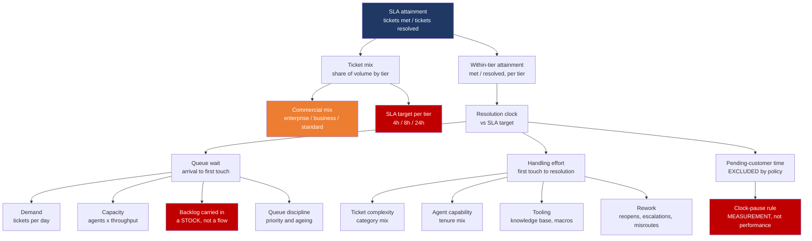
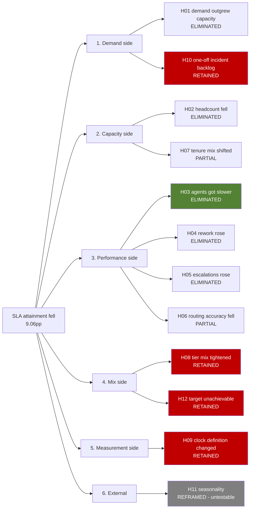

# KPI tree and issue tree

Two different diagrams that get confused with each other constantly.

A **KPI tree** decomposes a metric into the drivers that arithmetically determine it. It is
a structural fact about the metric and does not change when the business changes.

An **issue tree** enumerates the candidate explanations for an observed movement. It is a
hypothesis space, it must be MECE (mutually exclusive, collectively exhaustive), and it is
built fresh for each investigation.

You need the first to build the second. Skipping straight to a list of theories is how a
root-cause analysis ends up testing whatever the loudest person in the room suspects.

---

## 1. KPI tree — what determines SLA attainment

Red nodes are where the causes turned out to be. Orange is the driver that moved them.

### Three things this tree makes visible that a metric definition does not

**1. Mix sits above performance, not beside it.** Attainment is
`sum over tiers of (volume share x within-tier attainment)`. A movement in the metric can
come entirely from the first factor with no change in the second. Any investigation that
starts at "within-tier attainment" cannot see it.

**2. Backlog is a stock, everything else on that branch is a flow.** Demand, capacity and
throughput are rates. Backlog is an accumulated level. A stock built up by a past event keeps
depressing the metric after the event ends, and it needs a one-off drawdown rather than a
permanent rate change. Putting them on the same branch without labelling the difference is
how "we have a backlog" becomes "we need more headcount".

**3. The clock-pause rule is a leaf on the tree.** It is not a driver of performance at all —
it is a driver of *measurement*. It belongs on the tree precisely because it can move the
metric without anything happening in the business, and a tree that only contains real-world
drivers cannot represent that.

### The node that decided the investigation

`SLA target per tier` is drawn as an input, and everywhere in the business it was treated as
a constant. It is the one node nobody thought to question — and the enterprise 4-hour target
turned out to be **unachievable at any staffing level**, with a ceiling of 85.60% against a
95% contractual threshold.

**A KPI tree is also an audit of what you have assumed is fixed.**

---

## 2. Issue tree — candidate explanations, MECE

Every branch below was tested. Results, queries and verdicts are in
[`sql/01_hypotheses.sql`](sql/01_hypotheses.sql) and the output of `make analyse`.

### Verdict summary

| Verdict | Count | Meaning |
|---|---|---|
| **RETAINED** | 4 | Moved in the harmful direction by a material amount |
| **PARTIAL** | 2 | Real and harmful, too small to be a root cause |
| **ELIMINATED** | 5 | Did not move, or moved in the direction that *helps* |
| **REFRAMED** | 1 | Not answerable with the data available |

The materiality bar — **1.0 percentage point** of a ~9pp decline — was declared in
`atlas.thresholds` before any result was computed. A bar set after seeing the results is not
a bar.

### Why the eliminated branches are in the deliverable

Five hypotheses were ruled out. It would be shorter to present only the four that survived.

The eliminated ones are kept because **an analysis that omits them gets relitigated by
whoever's theory went unmentioned.** "Did you check whether escalations went up?" is a
reasonable question, and the difference between a five-minute answer and a re-opened
investigation is whether the query and the number are already written down.

`H03 — agents became slower` is the most important row in the table, because it is the
hypothesis the executive proposal rests on, and it is **eliminated with evidence pointing the
opposite way**: mix-adjusted work-clock attainment improved **+0.99pp**.

> **My first version of that test was wrong**, in exactly the way this project is about. I
> compared *blended* work-clock attainment, which fell 96.39% → 94.89%, and the hypothesis
> came back RETAINED — endorsing the headcount request. The blended figure falls because
> enterprise volume grew and enterprise carries a tighter target. Holding volume shares at
> their baseline values reverses the verdict. The aggregation trap the whole investigation
> exists to expose was sitting inside its own hypothesis test.

### H11: recorded as untestable rather than eliminated

Seasonality cannot be assessed with twelve months of data — there is no prior-year
comparison. Marking it ELIMINATED would be a false claim; dropping it would leave the tree
not collectively exhaustive.

It is bounded rather than dismissed: seasonality cannot explain a **measurement change**
(H09) or a **deliberate commercial mix shift** (H08), which together account for most of the
decline. "We cannot test this, and here is why it cannot be the main story" is a legitimate
finding.
